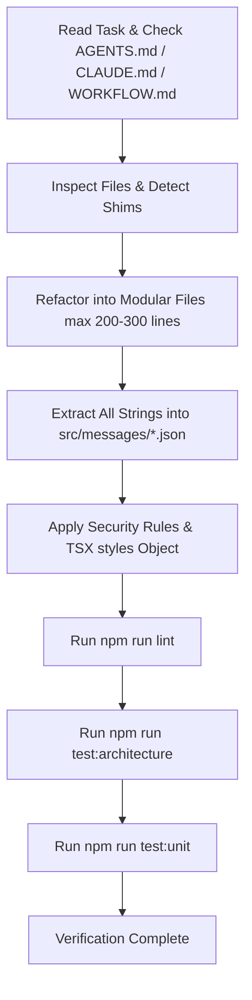

# WORKFLOW.md — Antigravity Agent & Repository Workflow

This document defines the official operational workflow, architectural guardrails, and verification rules for development with **Antigravity AI** in the `smart-radar-core` repository.

---

## 1. System Laws & Architectural Foundation (`AGENTS.md` V2.6-Secured)

All code developed in `smart-radar-core` must obey the core edge architecture defined in [AGENTS.md](file:///d:/freelance/Radar/smart-radar-core/AGENTS.md):

1. **Edge-First / Zero-Cost Processing (SC55)**:
   - High-volume spatial calculations, price comparisons, and trip meter calculations execute on-device (client-side).
   - Use `h3-js` Resolution 9 (`h3ToParent` / `geoToH3`) for spatial indexing and momentum rings.
2. **OSRM Routing & Fallback Protocol**:
   - Distance and ETA calculation uses self-hosted OSRM endpoints behind secure HTTPS proxies.
   - **Offline/Timeout Fallback**: If OSRM fails or times out (>1500ms), fallback immediately to on-device **Haversine** distance multiplied by the Jordan road correction coefficient **1.3**.
3. **Market Pricing Engine & Safety Controls**:
   - Tariff formula: $\text{Fare} = \text{Base Fare} + (D_{\text{OSRM}} \times \text{Tariff/km}) + (T_{\text{OSRM}} \times \text{Tariff/min})$.
   - **Amber Warning (10% - 14.9% deviation)**: Reduced rank, display quality warning to rider.
   - **Crimson Block (≥15% deviation)**: Input fields locked, proposal submit button frozen programmatically.
4. **Zero-Captain Fallout Protocol**:
   - Rider drops a silent buoy ("Rider Drop & Wait") with 180s (3 min) radar scan limit.
   - If no driver responds within 180s, automatically dissolve buoy, hide overlay via smooth CSS transition, and notify rider.
5. **Kernel Anti-Cheat**:
   - Local device time is untrusted; use **Network Time Delta** computed on general pulse sync.
   - Encrypt local meter state with a cryptographic signature hash.
   - Limit rider active concurrent requests to **1**. Consecutive cancellations (≥3) penalize immunity score.

---

## 2. Directory Architecture & Refactoring Rules (`CLAUDE.md`)

`src/` follows a modern layered architecture (`app`, `features`, `shared`) enforced strictly by `npm run test:architecture`:

```
src/
├── app/              # Next.js App Router pages (renders UI components)
├── features/         # Feature modules (captain, rider, auth, admin, ads, wallet, etc.)
│   └── <feature>/
│       ├── components/
│       ├── hooks/
│       ├── services/
│       └── contract.ts # PUBLIC contract exposed to other features
└── shared/           # Cross-feature reusable utilities, hooks, components
```

### Critical Rules & File Size Boundaries:
- **Modular Code & Max File Size (200–300 Lines)**:
  - When modifying or creating files, actively refactor large monolithic files into smaller, focused modules.
  - **Target Max File Length**: **200 to 300 lines**.
  - Extract complex UI sections into child components under `components/`, business logic into custom hooks under `hooks/`, and algorithms into helper services under `services/`.
- **Layer Isolation**:
  - `shared/**` must NEVER import from `features/**`.
  - `features/**` must NEVER import from `app/**`.
  - Cross-feature imports MUST go through the target feature's `contract.ts` (e.g. `@/features/auth/contract`). Direct imports into another feature's internal components/hooks are forbidden.
- **Legacy Shim Awareness**:
  - Files under `src/core/`, `src/hooks/`, `src/lib/`, `src/components/`, `src/server/` are legacy locations.
  - Many legacy files are 1-line re-export shims. **Always check if a file is a shim before editing**, and update the real source under `features/` or `shared/`.

---

## 3. Comprehensive i18n JSON Localization

- **Zero Hardcoded Text**:
  - **NO user-facing text or hardcoded strings** may be written directly in TSX components, toast notifications, dialogs, buttons, or error messages.
- **JSON Dictionary Source of Truth**:
  - All Arabic and English UI strings must be defined in `src/messages/ar.json` and `src/messages/en.json`.
- **Translation Hooks**:
  - Use `use-dashboard-language` or `next-intl` translation hooks (`const { t } = useDashboardLanguage()`) to resolve strings dynamically.

---

## 4. Strict Security & Server-Authoritative Trust

- **Server-Side Identity & Auth Verification**:
  - Never trust client-side role claims, pricing inputs, or local device timestamps.
  - Re-verify identity server-side via `verifyFirebaseIdToken` / Supabase auth tokens.
- **Concurrency & Rate Limiting**:
  - All state-mutating endpoints (`/api/*`) MUST go through `rateLimiterMiddleware` and `acquireBackendLock`.
- **SSRF & Input Hardening**:
  - Link/URL resolution endpoints MUST use `isSafeUrl` / `isSafeIp` / `secureFetch` to prevent SSRF and internal network access.
- **Kernel Anti-Cheat Hash Integrity**:
  - Meter state and trip records must be cryptographically hashed and verified before committing to database ledger.

---

## 5. Mandatory TSX Component Styling Rules

`npm run test:architecture` enforces styling constraints on all `.tsx` files:

1. **Top-Level `styles` Object**:
   - Every `.tsx` file MUST contain exactly ONE top-level object declaration:
     ```tsx
     const styles = {
       container: "flex flex-col w-full p-4 bg-background",
       header: "text-lg font-bold text-teal-400",
     } as const;
     ```
2. **JSX `className` Directives**:
   - Never write raw Tailwind string literals directly inside JSX `className="..."` attributes.
   - Use `className={styles.key}` or `className={cn(styles.a, condition && styles.b)}`.
3. **No Dynamic Component-Local Tailwind Strings**:
   - All Tailwind utility class definitions must reside inside the file's top-level `styles` object.

---

## 6. Dual-Backend Integration Rules

- **Express / Server.ts (`live, primary`)**: Custom Express wrapper around Next.js App Router for sovereign `/api/*` endpoints.
- **Firebase Cloud Functions (`functions/`)**: Standalone package for live operational trip logic, background cleanup, and sovereign registrations.
- **Supabase**: User Auth (Phone + Password) and static reference tables (`countries`/`governorates`/`districts`).
- **Firestore**: Ephemeral real-time operational data (trips, biddings, active radar buoys).

---

## 7. Development & Verification Protocol

Whenever implementing a feature, refactoring, or fixing a bug, execute the following workflow:



### Verification Commands:

```bash
# 1. TypeScript compilation check
npm run lint

# 2. Architectural boundary & TSX styling test
npm run test:architecture

# 3. Comprehensive unit test suite
npm run test:unit

# 4. End-to-end repository verification
npm run verify
```
